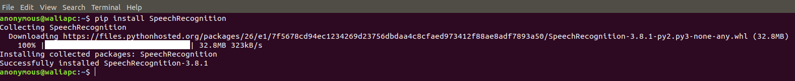
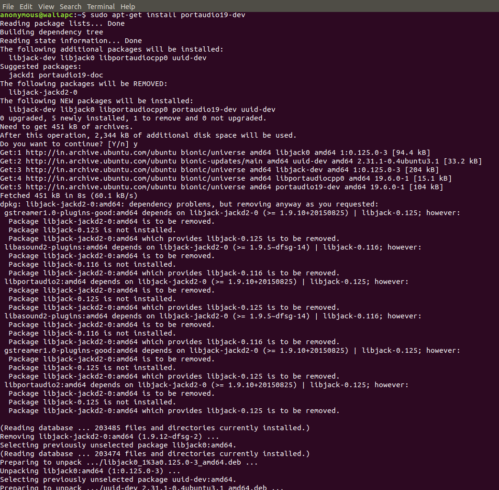
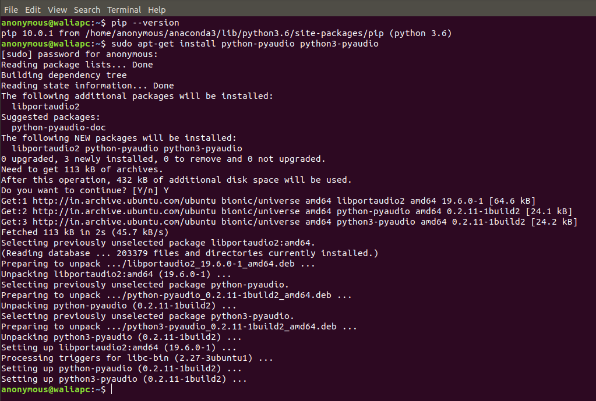
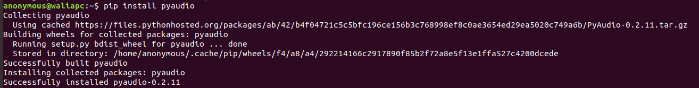
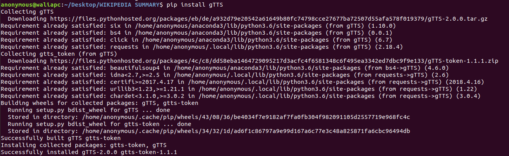
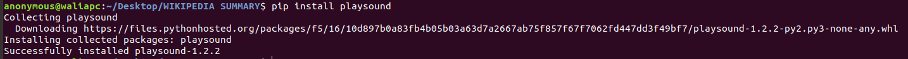
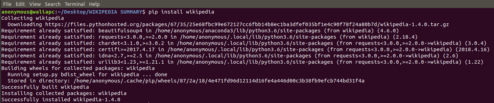

# WIKIPEDIA-SUMMARY-AUDIO

Python programme to search for anything in Wikipedia in your own national language. The speciality of this programme is that it is completely text-less which means it doesn't need user to type anything. The user can just use his or her voice and know about the interested topic

## REQUIREMENTS

### 1. python 3.x :snake:

### 2. pip3 10.x (Recommended 9.x)

First check using:

```bash
pip --version
```

If not installed or pip for python 2 than:

```bash
sudo apt update
sudo apt install python3-pip
pip3 --version / pip --version
```

### 3. Installing packages of pip for running python3 code

### Installation

```bash
pip install <package name>
```

### For listing all pip3 packages

```bash
pip list / pip3 list
```

### PACKAGES

#### 1. SpeechRecognition

```bash
pip install SpeechRecognition
```



#### 2. pyaudio

```bash
sudo apt-get install portaudio19-dev
sudo apt-get install python-pyaudio python3-pyaudio / sudo apt install python3-pyaudio
pip install pyaudio
```

##### portaudio19-dev



##### python3-pyaudio



##### pyaudio



#### 3. gTTS

```bash
pip install gTTS
```



#### 4. playsound

```bash
pip install playsound
```



#### 5. wikipedia

```bash
pip install wikipedia
```



## RUN

* You would need to run code.py in src folder by following commands:

```bash
python3 code.py
```

* The running of file will create many audio files(.mp3) which are used by the computer to speak out certain strings.

* Play .mp3 file for output.  

## OBJECTIVE

Make it adaptable to more national languages by using a better API and linking it with other text-to-speech facilties(working on it.

## CONTRIBUTION

See [CONTRIBUTING.md](CONTRIBUTING.md) 

## AUTHOR

Hardik Yadav

## CONTRIBUTORS

[CONTRIBUTORS](CONTRIBUTORS.md)

:octocat: HAPPY CODING :octocat: